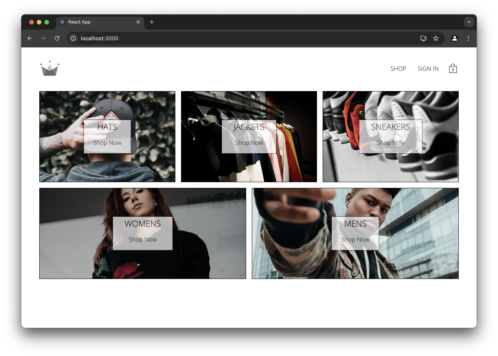
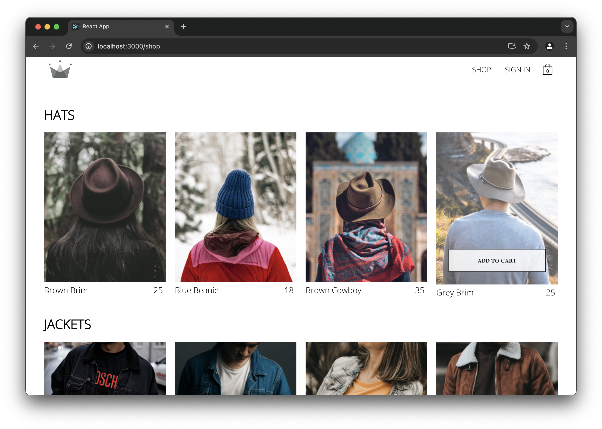
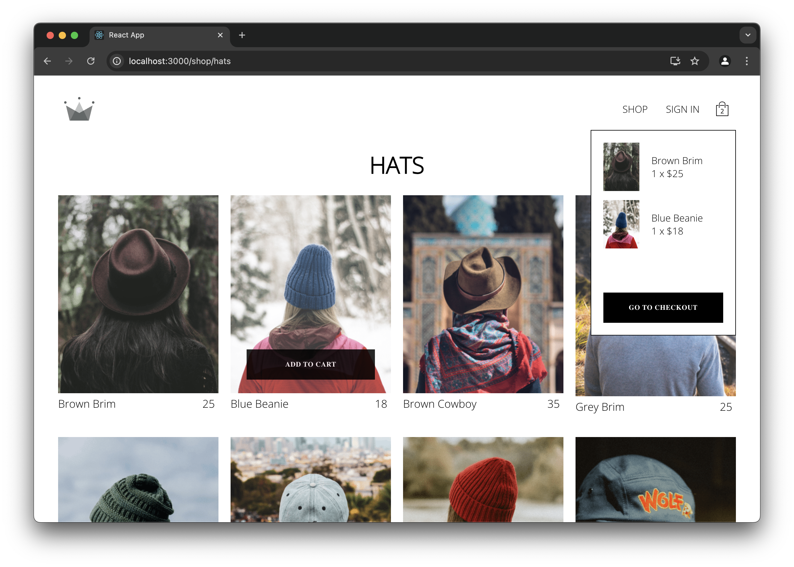
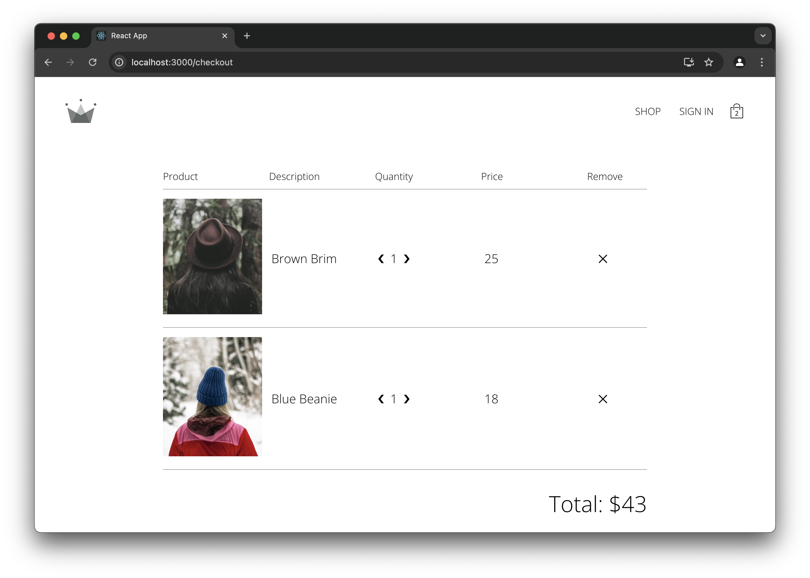
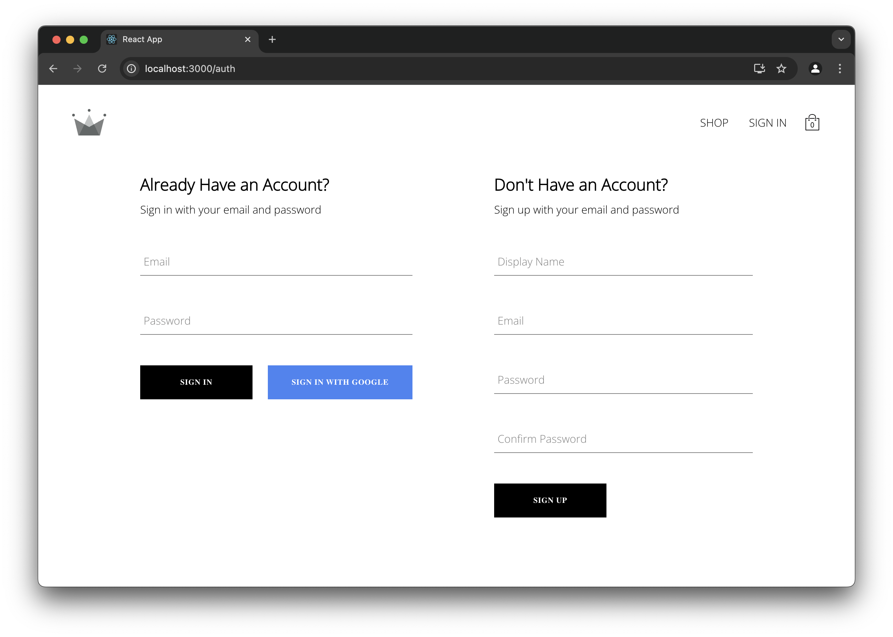

# Ecommerce Web Application

This is a fully functional e-commerce web application that allows users to browse clothing by category, add items to a cart, sign in or create an account, and proceed to checkout. Built using React and Redux, the app provides a smooth user experience with persistent authentication and cart state using Firebase and Redux Persist.

---

## Preview
#### Homepage


#### Shopping Categories Page


#### Add to Cart with Cart Showing on Top Right


#### Checkout Page


#### User Create Account/Log In Page



---

## Features
- **Browse Products by Category**
- **Add Items to Cart**
- **User Authentication (Sign In / Sign Up)**
- **Persistent Cart using Redux Persist**
- **Checkout with Total Calculation**
- **Styled with Sass and Styled Components**

---

## Tech Stack

| Category        | Tech                             |
|----------------|----------------------------------|
| Frontend       | React, React Router DOM          |
| State Management | Redux, Redux Thunk, Reselect   |
| Styling        | Sass, Styled Components          |
| Authentication | Firebase                         |
| Build Tool     | Create React App (CRA)           |

## Running Locally
1. **Clone the repository:**
```bash
git clone https://github.com/justincyk/EcommerceApp.git
cd EcommerceApp
```

2. **Install Dependencies**
```bash
npm install
```

3. **Set up Firebase**
   1. Create a Firebase project at https://firebase.google.com
   2. Enable Authentication (Email/Password)
   3. Create a .env file in the root directory and add your Firebase config:
    ```bash
    REACT_APP_FIREBASE_API_KEY=your_api_key
    REACT_APP_FIREBASE_AUTH_DOMAIN=your_auth_domain
    REACT_APP_FIREBASE_PROJECT_ID=your_project_id
    REACT_APP_FIREBASE_STORAGE_BUCKET=your_storage_bucket
    REACT_APP_FIREBASE_MESSAGING_SENDER_ID=your_sender_id
    REACT_APP_FIREBASE_APP_ID=your_app_id
    ```
   4. Go to `src/utils/firebase/firebase.utils.js` and update firebaseConfig
   ```bash
   const firebaseConfig = {
    apiKey: process.env.REACT_APP_FIREBASE_API_KEY,
    authDomain: process.env.REACT_APP_FIREBASE_AUTH_DOMAIN,
    projectId: process.env.REACT_APP_FIREBASE_PROJECT_ID,
    storageBucket: process.env.REACT_APP_FIREBASE_STORAGE_BUCKET,
    messagingSenderId: process.env.REACT_APP_FIREBASE_MESSAGING_SENDER_ID,
    appId: process.env.REACT_APP_FIREBASE_APP_ID,
   };
   ```

4. **Run the App**
   1. `npm start`
      - The app will run at `http://localhost:3000`

5. **Build for Production**
   1. `npm run build`

